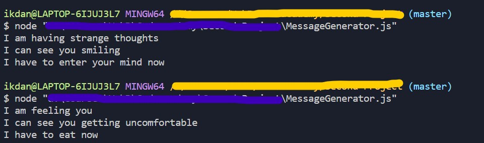

# **Random Message Generator**

_This being the first project of mine while learning JavaScript. Please ignore the silly messages I have put though._

### **Here is One of the ScreenShots of this program:**



## How to run this file:

```
Just open this Javascript file in your terminal using Node.js and run it. I prefer using an IDE as they have user friendly interface and sometimes they do all the work for you like in VS Code.
```

## In this project, Tools I used:

- JavaScript
- Node.js
- A little bit of algorithm (just kidding)
- ~~What else do you want? I am just starting up. This is a demo project.~~

_Will be adding more messages in future soon. Or you can try adding some yourself._
